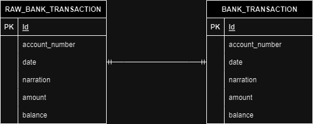

# ESUPERFUND-Bank-Application

## Table of Contents

- [Background](#Background)
- [Documentation](#Documentation)
- [Getting Started](#Getting-Started)

## Background
This GitHub page is for the take-home assessment for the ESUPERFUND C# Junior Developer position. The goal was to develop a small banking transaction back-end.  

I have developed a .NET CORE Web API-based back-end solution for the assessment. The documentation details are in the documentation page. The solution itself is in the HTTP-API folder.  

## Documentation
In the documentation folder, it contains the requirements, the ERD diagram and the CSV file containing the initial data. The ERD diagram looks like this:



This design was chosen because the RAW_BANK_TRANSACTION table and the BANK_TRANSACTION table will contain identical information. Hence, it is a one-to-one relationship. The reason is after the balances are closed successfully in the raw table, that information is transferred over to the normal table.

For the database, Azure SQL Server was chosen, and a free-tier application was used alongside the development of the back end. Please feel free to replace this with another SQL Server.

## Getting Started
Before starting make sure to have **.NET Core 7** installed and running in your application. The installation guide can be found [here](https://dotnet.microsoft.com/en-us/download/dotnet/7.0).

Follow these installation steps to run the application.

1. Install the .NET Entity Framework CLI
- ```dotnet tool install --global dotnet-ef```
2. Update the appsettings.json file in the HTTP-API folder with your database connection string.
3. Run these migration instructions to set up the database
- ```dotnet ef migrations add Initialization```
- ```dotnet ef database update```
4. Run the following command to start the server. Go to your "localhost:PORT_NUMBER/index.html" URL to view the generated Swagger page.
- ```dotnet run```
5. Interact with the back-end application by using the Swagger page.

## Future Work
These are the following future work that can enhance the application.
- Authentication and authorization
- Develop a front-end application to interact with this back-end application
- Add more banking features...